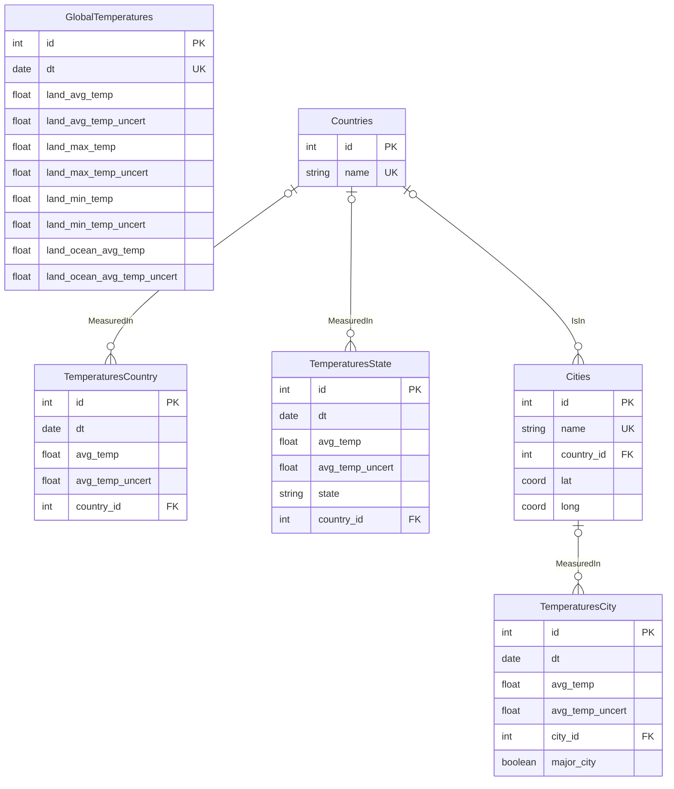

```mermaid
erDiagram 
GlobalTemperatures {
    int id PK
    date dt UK
    float land_avg_temp
    float land_avg_temp_uncert
    float land_max_temp
    float land_max_temp_uncert
    float land_min_temp
    float land_min_temp_uncert
    float land_ocean_avg_temp
    float land_ocean_avg_temp_uncert
}

TemperaturesCity {
    int id PK
    date dt 
    float avg_temp
    float avg_temp_uncert
    int city_id FK
    boolean major_city
}

TemperaturesCountry {
    int id PK
    date dt 
    float avg_temp
    float avg_temp_uncert
    int country_id FK
}

TemperaturesState {
    int id PK
    date dt 
    float avg_temp
    float avg_temp_uncert
    string state
    int country_id FK
}

Countries |o--o{ TemperaturesCountry: MeasuredIn
Countries |o--o{ TemperaturesState: MeasuredIn
Countries {
    int id PK
    string name UK
}

Cities |o--o{ TemperaturesCity: MeasuredIn
Countries |o--o{ Cities: IsIn
Cities {
    int id PK
    string name UK
    int country_id FK
    coord lat
    coord long
}
```
