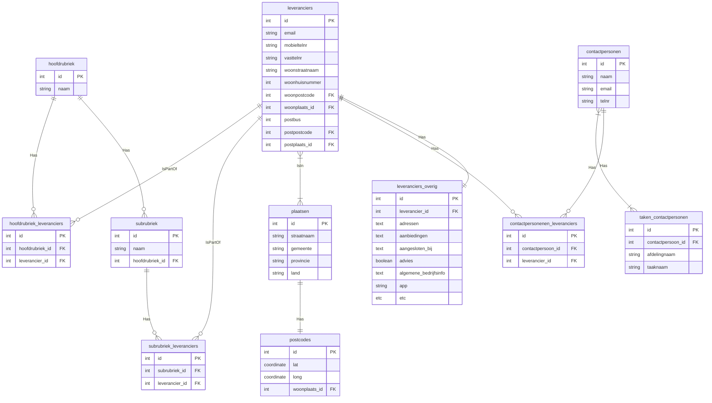

```mermaid
erDiagram
    hoofdrubriek ||--o{ hoofdrubriek_leveranciers: Has
    hoofdrubriek ||--o{ subrubriek: Has
    leveranciers ||--o{ hoofdrubriek_leveranciers: IsPartOf
    leveranciers ||--o{ subrubriek_leveranciers: IsPartOf
    subrubriek ||--o{ subrubriek_leveranciers: Has
    leveranciers }|--|{ plaatsen: IsIn
    plaatsen ||--|| postcodes: Has
    contactpersonen }|--|{taken_contactpersonen: Has
    leveranciers ||--o{contactpersonenen_leveranciers: Has
    contactpersonen ||--o{contactpersonenen_leveranciers: Has
    leveranciers ||--|| leveranciers_overig: Has
    hoofdrubriek {
        int id PK
        string naam
    }
    hoofdrubriek_leveranciers {
        int id PK
        int hoofdrubriek_id FK
        int leverancier_id FK
    }
    subrubriek_leveranciers {
        int id PK
        int subrubriek_id FK
        int leverancier_id FK
    }
    subrubriek {
        int id PK
        string naam 
        int hoofdrubriek_id FK
    }
    leveranciers {
        int id PK
        string email
        string mobieltelnr
        string vasttelnr
        string woonstraatnaam
        int woonhuisnummer
        int woonpostcode FK
        int woonplaats_id FK
        int postbus
        int postpostcode FK
        int postplaats_id FK
    }
    plaatsen {
        int id PK
        string straatnaam
        string gemeente
        string provincie
        string land
    }
    postcodes {
        int id PK
        coordinate lat
        coordinate long
        int woonplaats_id FK
    }
    contactpersonen {
        int id PK
        string naam
        string email
        string telnr
    }
    taken_contactpersonen {
        int id PK
        int contactpersoon_id FK
        string afdelingnaam
        string taaknaam
    }
    contactpersonenen_leveranciers {
        int id PK
        int contactpersoon_id FK
        int leverancier_id FK
    }
    leveranciers_overig {
        int id PK
        int leverancier_id FK
        text adressen
        text aanbiedingen
        text aangesloten_bij
        boolean advies
        text algemene_bedrijfsinfo
        string app
        etc etc
    }

```
