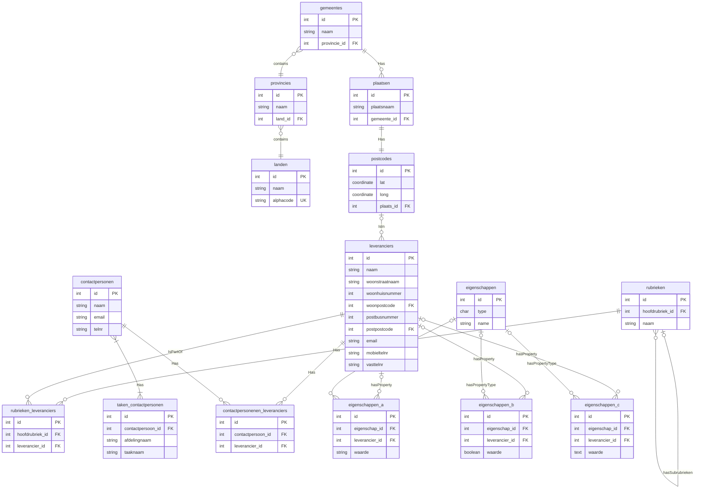

```mermaid
erDiagram
    leveranciers {
        int id PK
        string naam
        string woonstraatnaam
        int woonhuisnummer
        int woonpostcode FK
        int postbusnummer
        int postpostcode FK
        string email
        string mobieltelnr
        string vasttelnr
    }

    rubrieken o|--o{ rubrieken: hasSubrubrieken
    rubrieken {
        int id PK
        int hoofdrubriek_id FK
        string naam
    }

    rubrieken ||--o{ rubrieken_leveranciers: Has
    leveranciers ||--o{ rubrieken_leveranciers: IsPartOf
    rubrieken_leveranciers {
        int id PK
        int hoofdrubriek_id FK
        int leverancier_id FK
    }

    gemeentes ||--o{ plaatsen: Has
    plaatsen {
        int id PK
        string plaatsnaam
        int gemeente_id FK
    }

    landen {
        int id PK
        string naam
        string alphacode UK
    }

    provincies }o--|| landen: contains
    provincies {
        int id PK
        string naam
        int land_id FK
    }

    gemeentes }o--|| provincies: contains
    gemeentes {
        int id PK
        string naam
        int provincie_id FK
    }

    plaatsen ||--|| postcodes: Has
    postcodes |o--o{leveranciers: IsIn
    postcodes {
        int id PK
        coordinate lat
        coordinate long
        int plaats_id FK
    }

    contactpersonen {
        int id PK
        string naam
        string email
        string telnr
    }

    contactpersonen }|--|{taken_contactpersonen: Has
    contactpersonenen_leveranciers {
        int id PK
        int contactpersoon_id FK
        int leverancier_id FK
    }

    leveranciers ||--o{contactpersonenen_leveranciers: Has
    contactpersonen ||--o{contactpersonenen_leveranciers: Has
    taken_contactpersonen {
        int id PK
        int contactpersoon_id FK
        string afdelingnaam
        string taaknaam
    }

    eigenschappen {
        int id PK
        char type
        string name
    }

    leveranciers |o--o{ eigenschappen_a: hasProperty
    eigenschappen |o--o{eigenschappen_a: hasPropertyType
    eigenschappen_a {
        int id PK
        int eigenschap_id FK
        int leverancier_id FK
        string waarde
    }

    leveranciers |o--o{ eigenschappen_b: hasProperty
    eigenschappen |o--o{eigenschappen_b: hasPropertyType
    eigenschappen_b {
        int id PK
        int eigenschap_id FK
        int leverancier_id FK
        boolean waarde
    }

    leveranciers |o--o{ eigenschappen_c: hasProperty
    eigenschappen |o--o{eigenschappen_c: hasPropertyType
    eigenschappen_c {
        int id PK
        int eigenschap_id FK
        int leverancier_id FK
        text waarde
    }

```
