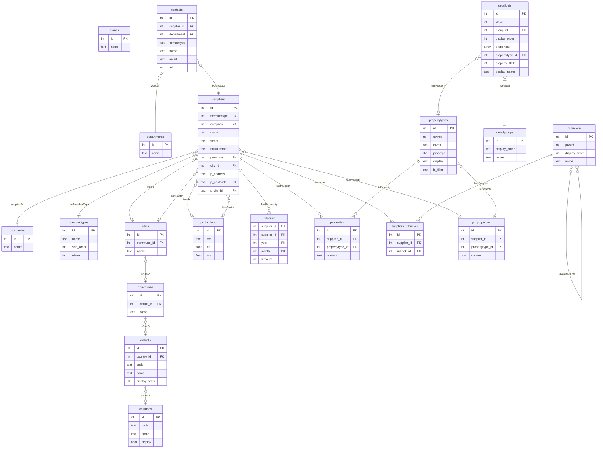

```mermaid
erDiagram 
brands {
    int id PK
    text name
}

companies {
    int id PK
    text name
}

contacts {
    int id PK
    int supplier_id FK
    int department FK
    text contacttype 
    text name
    text email
    text tel
}

contacts o{--|| departments: worksIn
departments {
    int id PK
    text name
}

contacts o{--|| suppliers: isContactOf
suppliers o{--o| companies: suppliesTo
suppliers {
    int id PK
    int membertype FK
    int company FK
    text name
    text straat
    text huisnummer
    text postcode FK
    int city_id FK
    text p_address
    text p_postcode FK
    text p_city_id FK
}

suppliers |{--|| membertypes: hasMemberType 
membertypes {
    int id PK
    text name
    int sort_order
    int ulevel
}

suppliers }o--o| cities: livesIn
suppliers }o--o| cities: hasPostIn
cities {
    int id PK
    int commune_id FK
    text name
}

cities }o--o| communes: isPartOf
communes {
    int id PK
    int district_id FK
    text name
}

communes }o--o| districts: isPartOf
districts {
    int id PK
    int country_id FK
    text code 
    text name 
    int display_order
}

districts }o--o| countries: isPartOf
countries {
    int id PK
    text code
    text name
    bool display
}

suppliers }o--o| pc_lat_long: livesIn
suppliers }o--o| pc_lat_long: hasPostIn
pc_lat_long {
    int id PK
    text pc6
    float lat
    float long
}

suppliers ||--o{ hitcount: hasPopularity
hitcount {
    int supplier_id FK
    int supplier_id PK
    int year PK
    int month PK
    int hitcount
}

suppliers ||--o{ properties: hasProperty
properties {
    int id PK
    int supplier_id FK
    int propertytype_id FK
    text content
}

propertytypes ||--o{ properties: isProperty
propertytypes {
    int id PK
    int csvreg
    text name
    char proptype
    text display 
    bool is_filter
}

detaildefs }o--o| propertytypes: hasProperty
detaildefs {
    int id PK
    int vlevel
    int group_id FK
    int display_order
    array properties
    int propertytype_id FK
    int property_DEF
    text display_name
}

detaildefs }|--|| detailgroups: isPartOf
detailgroups {
    int id PK
    int display_order 
    text name
}

rubrieken }o--o{ rubrieken: hasSubrubriek
rubrieken {
    int id PK
    int parent
    int display_order
    text name
}

suppliers ||--o{ suppliers_rubrieken: inRubriek
rubrieken ||--o{suppliers_rubrieken: hasSupplier
suppliers_rubrieken {
    int id PK
    int supplier_id FK
    int rubriek_id FK
}

suppliers }o--|| yn_properties: hasProperty
propertytypes }o--|| yn_properties: isProperty
yn_properties {
    int id PK
    int supplier_id FK
    int propertytype_id FK
    bool content
}
```
